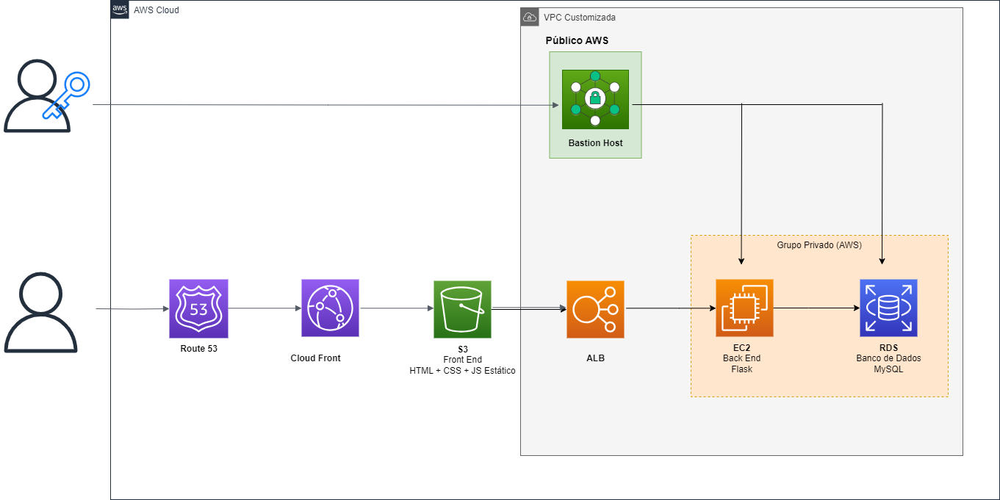

# Arquitetura Corporativa

[Video da arquitetura em funcionamento (Implementação do Backend)](https://youtu.be/smezUekZQEQ)

Este documento corresponde ao que é solicitado no card "Arquitetura Corporativa" na Sprint 2.

A imagem acima oferece uma visão geral da aplicação web desenvolvida para lidar com altas demandas. Essa representação visual ilustra a perspectiva da aplicação em relação aos dois principais grupos de usuários impactados de forma mais direta pela funcionalidade dela. O primeiro grupo é composto por indivíduos que possuem chaves de acesso, mais especificamente, funcionários da Stone que fazem parte da equipe de desenvolvimento. Esses usuários irão interagir com a aplicação utilizando um endereço IP público hospedado na AWS. As permissões de acesso que eles possuem englobam tanto a capacidade de edição quanto de leitura, cuja extensão é determinada pela criação de regras de negócio dentro do framework de Gerenciamento de Identidade e Acesso (IAM). Já o segundo grupo de usuários são os clientes finais da aplicação, que utilizam os serviços oferecidos pela plataforma, que farão acesso da plataforma através de um link público.

<h2>Principais Componentes e Funcionalidades na Aplicação</h2>

- **Virtual Private Cloud (VPC):** Rede em que é possível carregar recursos da AWS em uma zona fechada pré-definida. Ela remete a uma rede acesso convecional, mas que você opera no seu próprio serviço ou data center com todos os serviços disponíveis da AWS. Serviços da AWS precisam de uma rede de execução, ela pode ser definida como pública ou privada a depender das necessidades de acesso para aquele serviço. Abaixo será especificado quais VPC's foram configuradas dentro da solução

- **Bastion Hosts:** desempenham a função de fornecer acesso seguro às instâncias Linux situadas nas sub-redes privadas e públicas da sua Rede Virtual Privada (VPC). Eles constituem a via através da qual o Gerente de Tecnologia da Informação pode realizar modificações diretas no código-fonte, banco de dados ou efetuar ajustes em configurações de serviços diretamente vinculados às máquinas hospedadas. É importante observar que esses hosts residem em uma camada de rede pública da AWS, onde são utilizados para facilitar a comunicação via internet. A presença de Bastion Hosts é obrigatória caso busque viabilizar a acessibilidade global dos serviços.

- **Amazon Elastic Compute Cloud (Amazon EC2):** oferece capacidade de computação escalável sob demanda na Nuvem da Amazon Web Services (AWS). Utilizar o Amazon EC2 reduz os custos de hardware, permitindo que você desenvolva e implante aplicativos de maneira mais rápida. É o serviço em que o backend (Flask) da aplicação é executado, é um serviço com IP de acesso Privado, então não é possível acessá-lo pela internet, o que aumenta a segurança em relação aos acessos relacionados a alterações na própria aplicação.

- **Amazon Relational Database Service (Amazon RDS):** é um conjunto de serviços gerenciados que simplifica a configuração, operação e escalabilidade de bancos de dados na nuvem. O RDS está inserido em uma rede privada. Essas redes são utilizadas para comunicação dentro de uma rede local e não são diretamente acessíveis pela internet. Ele também se encontra dentro de uma VPC privada e apenas pode ser acessado pelo usuário responsável por realizar alguma modificação nesse serviço.

- **Application Load Balance ALB:** Opera no nível de solicitações, direcionando o tráfego para destinos (instâncias EC2, contêineres, endereços IP e funções Lambda) com base no conteúdo da solicitação. Ideal para equilíbrio avançado de tráfego HTTP e HTTPS, também oferece um roteamento de solicitações avançado direcionado para a entrega de arquiteturas de aplicativos modernos, incluindo microsserviços e aplicações baseadas em contêineres. Ele simplifica e aprimora a segurança do seu aplicativo, garantindo o uso constante das cifras e protocolos SSL/TLS mais recentes. Dessa forma, são realizadas solicitações ao banco de dados e ao backend de maneira segura e escalável. Ele está localizado dentro de uma VPC customizada da AWS, o que significa que não é acessível através da WEB, no entanto, é possível pesquisá-lo e explorar suas configurações internas.

- **Amazon Simple Storage Service (Amazon S3):** Consiste em um serviço de armazenamento de objetos que oferece escalabilidade líder na indústria, disponibilidade de dados, segurança e desempenho. Clientes de todos os tamanhos e setores podem usar o Amazon S3 para armazenar e proteger qualquer quantidade de dados para uma variedade de casos de uso, como data lakes, sites, aplicativos móveis, backup e restauração, arquivamento, aplicativos empresariais, dispositivos IoT e análise de big data. No projeto, ele é responsável por armazenar o Front-end, principalmente por questões relacionadas ao custo (armazenamento e transferências de dados no S3 geralmente possuem custos menores para hospedar arquivos estáticos), melhoria no tempo de resposta, escalabilidade e desempenho (Distribuição automática para diversas regiões evitando alta latência em momentos de pico) e disponibilidade em momentos de falha no servidor.

- **CloudFront:** É um serviço da web que acelera a distribuição do seu conteúdo web estático e dinâmico, como arquivos .html, .css, .js e imagens, para os seus usuários. O CloudFront entrega o seu conteúdo por meio de uma rede global de centros de dados chamados de localizações de borda. Quando um usuário solicita conteúdo que você está servindo com o CloudFront, a solicitação é encaminhada para a localização de borda que oferece a menor latência (atraso de tempo), para que o conteúdo seja entregue com o melhor desempenho possível.

- **Domain Name System (DNS):** É a porta de acesso do cliente para a aplicação WEB, convertendo os nomes de domínio em endereços IP correspondentes para que a comunicação possa ocorrer entre os computadores pela internet.

<h2>Requisitos a serem cumpridos </h2>

Abaixo, é mostrado o detalhe de como a arquitetura aborda os requisitos da solução, incluindo balanceamento de carga, alta disponibilidade, recuperação de falhas e escalabilidade. Isso nos permitirá compreender melhor como os serviços da aplicação se relacionam com essas demandas específicas.

- **Balanceamento de Carga:** Para suprir as demandas de múltiplos clientes, a utilização de um grupo privado EC2 e RDS constitui um meio para garantir o equilíbrio da carga, garantindo a distribuição entre instâncias EC2 e réplicas RDS.
- **Capacidade de Failover:** Está relacionado a continuidade do serviço sem falhas, para isso é necessário considerar a replicação e backups regulares do banco de dados RDS, além de configurar grupos de alta disponibilidade tanto para as instâncias EC2 quanto para o RDS.

- **Elasticidade:** Pode ser alcançada ajustando-se a configuração do grupo de instâncias EC2 e dimensionando a capacidade do banco de dados RDS conforme necessário, no momento de criação ou alterando as configurações. Também é possível configurar regras de escalabilidade automática com base na carga ou uso do recurso.

- **Desempenho:** Todos os aspectos ligados ao desempenho estarão associados ao sistema de teste de carga utilizando K6 e Grafana. Isso será feito por meio de simulações de tráfego para verificar a latência e a resposta da aplicação.
  
- **Distribuição de Carga:** O Amazon CloudFront auxilia na distribuição da carga e na diminuição da latência para os usuários finais, aprimorando a qualidade de sua experiência.

- **Tolerância a Falhas:** Certificar que o banco de dados RDS tenha configurações de backup. Além de adicionar garantir atuação em zonas múltiplas para EC2 e o RDS, garantindo que uma falha em uma zona não cause interrupção da aplicação.

- **Escalabilidade:** Realizar os ajustes de recursos das instâncias EC2 e configurando o Auto Scaling para lidar com picos de demanda (até 35.000/segundo). Além de verificar se o Load Balancer (ALB) esteja configurado para distribuir a carga entre as instâncias EC2.

<h2> Referências: </h2>

- AMAZON WEB SERVICES. Aws (org.). Amazon Virtual Private Cloud features. 2023. AWS. Disponível em: https://aws.amazon.com/vpc/features/. Acesso em: 21 ago. 2023.

- AMAZON WEB SERVICES. Https://aws.amazon.com/solutions/implementations/linux-bastion/. 2023. AWS. Disponível em: https://aws.amazon.com/solutions/implementations/linux-bastion/. Acesso em: 21 ago. 2023.

- AMAZON WEB SERVICES. What is Amazon CloudFront? AWS. Disponível em: https://docs.aws.amazon.com/AmazonCloudFront/latest/DeveloperGuide/Introduction.html. Acesso em: 21 ago. 2023.

- AMAZON WEB SERVICES. What is Amazon S3? 2023. Disponível em: https://docs.aws.amazon.com/AmazonS3/latest/userguide/Welcome.html. Acesso em: 21 ago. 2023.
