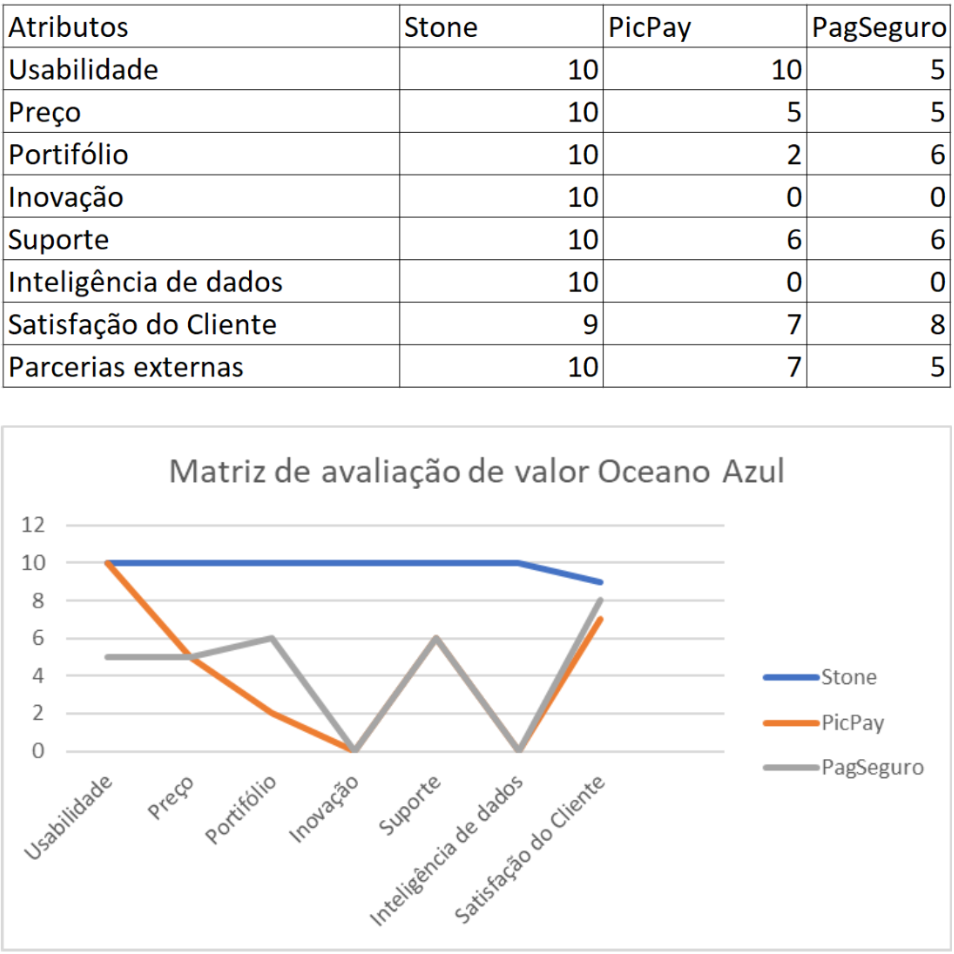
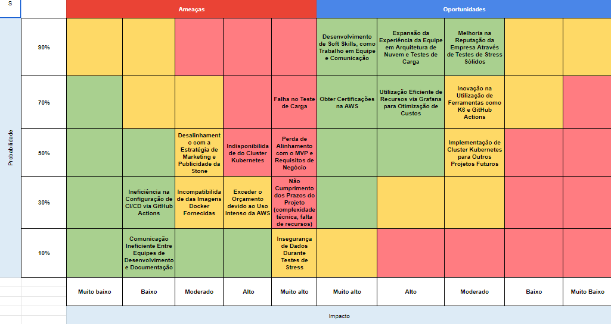
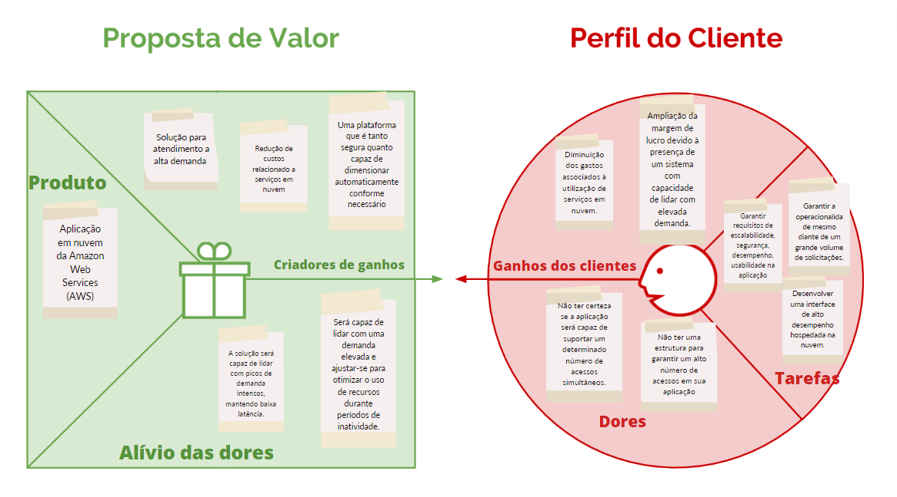
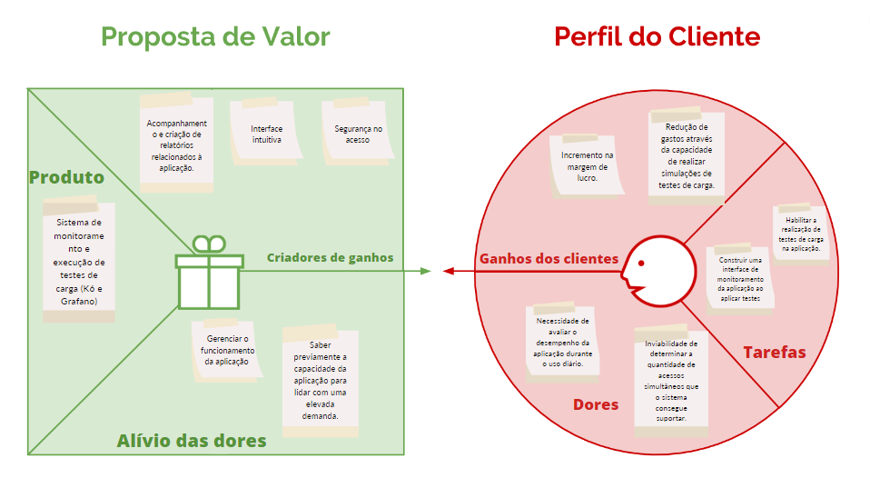

# Entendimento do Negócio

Este documento corresponde ao que é solicitado no card "Entendimento de Negócio" na Sprint 1.

##  Matriz de avaliação de valor Oceano Azul

A matriz acima busca sintetizar a análise que será realizada. Através da matriz de oceano azul, buscamos identificar possíveis oportunidades de mercado que ainda não são exploradas pelos competidores e criar produtos que preencham essas lacunas. 

A análise será feita com os dois principais competidores diretos da Stone, a PicPay e a PagSeguro. Esses players são muito bem estruturados e possuem um market share considerável. Sendo assim, iremos construir um produto que torne a Stone mais competitiva neste cenário. 

Elencamos diversos critérios que podem servir para diferenciar a Stone de seus concorrentes. Dentre eles:

+ Usabilidade (aumentar): em uma rápida abertura do site dos principais competidores podemos aplicar as heurísticas de Nielsen, que refletem a qualidade da UX de um site e perceber que a Stone e a PicPay se destacam neste aspecto, pois elas possuem sessões muito bem definidas e facilitam a conversão de clientes, pois as informações são disponibilizadas de forma clara, por exemplo, a Stone possui uma aba para produtos e dentro dela, podemos ver 4 sessões, uma para o seu negócio, uma para o seu uso pessoal, uma para pequenas empresas e por fim o campo outros. A PicPay faz o mesmo. Contudo, a PagSeguro possui um site mal projetado em relação às heurísticas citadas, pois não tem campos de atuação, por exemplo, o produto “Conta PJ” está disposto nas abas para o seu negócio e para o seu uso pessoal. Além disso, a página principal mostra diversas imagens com informações repetitivas e que não agregam valor, por exemplo, as bandeiras Mastercard, Visa e Elo aparecem 4 vezes e esse não é nenhum diferencial, pois todo o mercado fornece suporte a elas. E, por isso, foi atribuída nota 10 a Stone e PicPay e nota 5 a PagSeguro.

+ Preço (reduzir): o principal diferencial competitivo da Stone é o preço. Ela atua de forma agressiva neste setor e tem as menores taxas do mercado. Vamos analisar a taxa em cima do processamento feito em um cartão de débito, mas isso reflete em outras formas de pagamento também, a Stone cobra um valor de 0,85% em cima do preço de venda, enquanto os outros dois competidores cobram 1,99%. Essa é uma vantagem competitiva que pode ser muito bem explorada, pois ainda há margem de atuação e, por isso, a Stone recebeu nota 10 enquanto as outras 5.

+ Portfólio (aumentar): outro fator em que a Stone se destaca é em seu portfólio de produtos e isso facilita a conversão de vendas, pois, pode ser oferecido o produto com base no tipo e tamanho de um negócio e uma gama maior de clientes pode ser satisfeita. Sendo assim, ela oferece 5 tipos de maquininhas de cartão diferentes e para cada máquina ela oferta 5 serviços diferentes que variam a taxa, preço da máquina, suporte e outros fatores correlatos. A PagSeguro segue como o segundo melhor portfólio, pois oferece 5 máquinas diferentes mas o serviço delas é sempre o mesmo, você pode apenas contratar uma máquina diferente, e não taxas e outros serviços. Por fim temos a PicPay, que oferta apenas um único produto, o seu aplicativo online de links de pagamento, independente do tamanho e tipo do seu negócio. Com base nisso, atribuímos as notas 10, 6 e 2 às empresas Stone, Pagseguro e PicPay, respectivamente.

+ Inovação (criar): A Stone é a única empresa que consegue fazer o celular da pessoa se transformar em uma maquininha de cartão de crédito. Ela usa a tecnologia NFC para conseguir receber pagamentos por meio da aproximação do cartão de crédito ou débito. Isso é ótimo para um público específico que quer iniciar um negócio, mas que não quer arcar com os custos da maquininha, assim, ele pode validar o negócio e depois contratar serviços que sejam atraentes a ele. Será atribuído, então, nota 10 a Stone e 0 às demais que apenas fornecem o mesmo serviço que já existe no mercado.

+ Suporte (aumentar): com base em uma busca no site das três empresas, a Stone é a única que declara fornecer suporte online em até 5 segundos e garante trocar uma máquina com defeito sua em até um dia útil. Isso é um fator decisório para a maior parte dos clientes, pois eles têm a garantia de que a venda poderá ser concluída com sucesso. Notas 10, 6 e 6 para a Stone, PicPay e PagSeguro.

+ Inteligência de dados (aumentar): Em mais um ponto a Stone demonstra ser pioneira, pois, ela é a única empresa capaz de organizar todas as vendas de um único usuário e gerar um relatório final que pode trazer informações significativas ao empreendedor e isso contribui até mesmo para aspectos do ESG com relação a educação financeira, pois essa funcionalidade traz acessibilidade para a contabilidade pessoal. Notas 10, 0 e 0, respectivamente. 

+ Satisfação do cliente (aumentar): o principal órgão que infere a satisfação do cliente é o RaclameAqui, a empresa reúne a maior parte dos problemas enfrentados pelos clientes e agrega a satisfação geral deles e atribui uma nota a cada empresa. A Stone possui nota 9,0. A PagSeguro possui nota 8,1. E a PicPay, nota 7,4. E assim, temos as notas da matriz 9, 8 e 7, respectivamente. 

+ Parcerias externas (aumentar): O PicPay era o principal patrocinador do BBB, contudo, em uma decisão de negócios, eles decidiram abandonar essa decisão e, com isso, a Stone pode alinhar seu desejo e se tornou uma patrocinadora do programa. Essa parceria trouxe um fluxo enorme ao site deles e isso resultou em uma balança positiva. Por isso, atribuímos as notas 10, 7 e 5 para a Stone, PicPay e PagSeguro.

## Matriz de Risco

## Canvas Proposta de Valor

O Proposta de Valor Canvas faz parte do Business Model Canvas e destaca por que os clientes escolheriam um produto ou serviço. Divide-se em quatro partes:

**Produtos/Serviços:** O que é oferecido aos clientes.

**Tarefas/Problemas:** do Cliente: As necessidades que o produto resolve.
Ganhos do Cliente: Os benefícios do uso do produto.

**Dores do Cliente:** As dificuldades aliviadas pelo produto.

Esta ferramenta ajuda as empresas a entender como satisfazem os clientes e se destacam. Ajuda a criar estratégias de marketing, desenvolver produtos mais alinhados e comunicar o valor de forma eficaz.

Existem duas ideias aqui: uma é uma aplicação e a outra é um sistema para monitorar essa aplicação. Ambos se complementam, mas são para grupos diferentes.

**Aplicação:** É para pessoas usarem e fazerem coisas específicas. Ajuda as pessoas a resolverem problemas ou alcançarem objetivos.

**Sistema de Monitoramento:** É para pessoas que cuidam da aplicação, não os usuários finais. Ele acompanha como a aplicação está funcionando, encontra problemas e mantém tudo funcionando bem.

Essas duas ideias juntas fazem com que a aplicação seja útil e confiável tanto para quem a usa quanto para quem a mantém.

## Análise financeira do projeto

### Introdução

Nesta análise financeira, apresentaremos uma visão macro dos custos associados à execução de instâncias EC2 na Amazon Web Services (AWS) para lidar com uma carga de 32.000 requisições por segundo (RPS). Além disso, abordaremos as vantagens de cada instância exemplo(podem ser alteradas).

* Essa é uma análise inicial, que pode ser alterada conforme o projeto avança.

### Custos Estimados

A tabela abaixo apresenta uma análise aproximada dos custos mensais e anuais para cada instância EC2 sugerida:

|         **Instância**         | **Custo Mensal (USD)** | **Custo Anual (USD)** |
|:----------------------------:|:----------------------:|:--------------------:|
|    C5.18xlarge   |       $2,203.20      |      $26,811.60     |
|    r5.16xlarge   |       $2,993.04      |      $36,382.92     |
|    P3.2xlarge    |       $2,203.20      |      $26,811.60     |

* Custo Mensal: Custo diário(preço/hora * 24) * 30
* Custo Anual: Custo Mensal * 12

### Vantagens das Instâncias

A seguir, resumo as vantagens de cada instância EC2 sugerida:

1. **C5.18xlarge**:
   - Ideal para cargas intensivas em processamento.
   - Equilíbrio entre CPU e memória para manipulação eficiente de dados.

2. **r5.16xlarge**:
   - Grande quantidade de memória para lidar com grandes volumes de dados.
   - CPU poderosa para processamento rápido.

3. **P3.2xlarge**:
   - Aceleração por GPU (NVIDIA V100) para tarefas de aprendizado de máquina e processamento de imagens.
   - Paralelização de tarefas usando a GPU.

### Amazon RDS

O uso do Amazon RDS é fundamental para garantir escalabilidade e alta disponibilidade para o banco de dados da aplicação. Suas principais vantagens incluem gerenciamento simplificado, escalabilidade eficiente, alta disponibilidade e recursos de segurança.

Entretanto ainda não conseguimos estimar custos.

## Receitas 

Uma vez que o projeto visa estabelecer uma infraestrutura capaz de lidar com um grande volume de requisições e, considerando que o parceiro ainda não compartilhou informações sobre o orçamento alocado para essa fase do projeto, não estamos atualmente em posição de efetuar uma projeção precisa de receitas.

## Conclusão

Ao analisar os custos estimados e as vantagens das instâncias EC2 sugeridas, é evidente que cada opção tem seu próprio conjunto de benefícios. A combinação das instâncias adequadas às necessidades da aplicação, juntamente com o Amazon RDS para gerenciamento de banco de dados, criará uma infraestrutura robusta e escalável. 