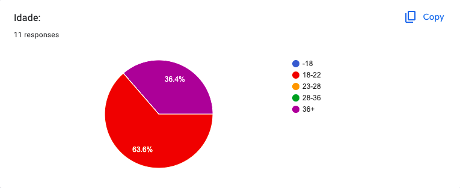
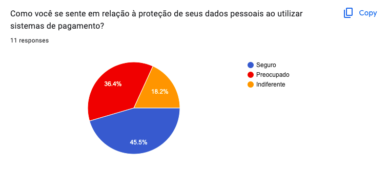
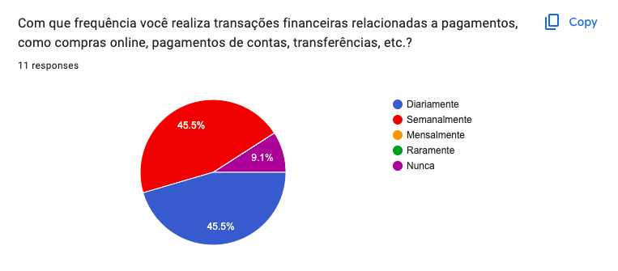
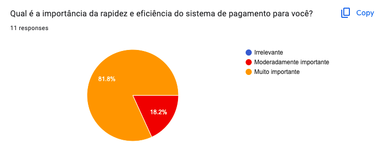
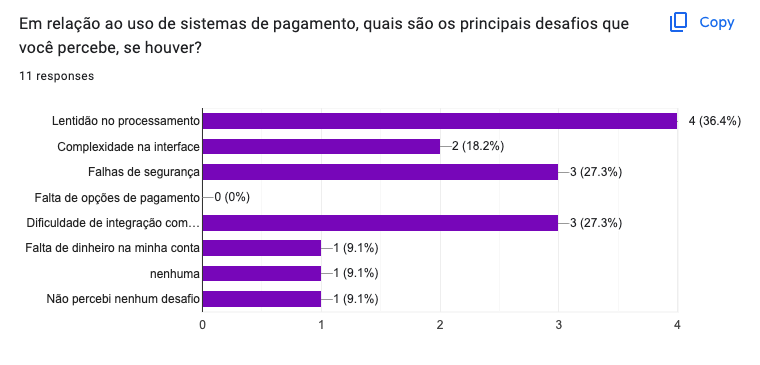
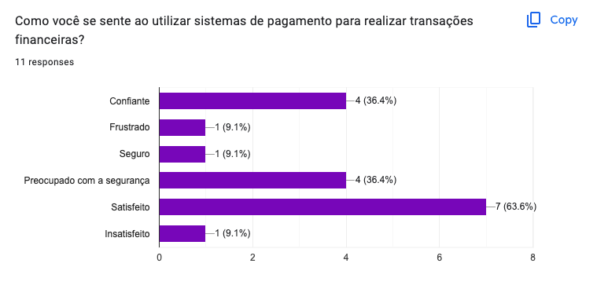

# Entendimento do usuário

Este documento corresponde ao que é solicitado no card "Entendimento do Usuário" na Sprint 1.

1. Imersão Preliminar

a) Pesquisa Exploratória

Objetivo:
O foco da pesquisa exploratória é entender o ambiente global do projeto. Isso envolve a investigação dos desafios tecnológicos e operacionais, identificando as necessidades dos usuários e alinhando os objetivos com a estratégia de negócios da empresa.

Metodologia:
A pesquisa exploratória foi realizada através de métodos multifacetados, que incluem:

- Entrevistas com Parceiros: Engajamentos estruturados com stakeholders como gerentes, desenvolvedores e representantes dos clientes para descobrir suas expectativas, preocupações e ideias valiosas para o projeto.
- Análise de Documentação: Estudo detalhado de documentos e relatórios relevantes para ganhar uma perspectiva clara do projeto, seus objetivos e requisitos críticos.

Insights Obtidos:

- Necessidades do Usuário:
    - Facilidade de Uso: A interface deve ser acolhedora e fácil de usar, conforme destacado pelos parceiros.
    - Eficiência: A velocidade de resposta é uma prioridade, refletindo a eficiência desejada.
    - Segurança: A proteção de dados é fundamental, com total aderência às regulamentações.

- Desafios Tecnológicos:
    - Compatibilidade: A integração com sistemas existentes pode ser desafiadora e requer atenção.
    - Regulamentações: Cumprir as leis e normas é crucial para o sucesso do projeto.

- Metas de Negócio:
    - Crescimento: Um objetivo de aumentar a base de clientes em foi estabelecido com base nas entrevistas.
    - Redução de Custos: A otimização de recursos e o fim dos  custos para foram identificados como importantes.
    - Satisfação do Cliente: A meta é alcançar mais em pesquisas de satisfação, conforme acordado com os parceiros.

b) Pesquisa Desk

Objetivo:
O objetivo da pesquisa desk neste contexto é compreender profundamente o cenário competitivo no setor de tecnologia financeira, o mercado de pagamentos, as tendências emergentes na escalabilidade e desempenho, bem como outros fatores externos que podem afetar o projeto de Sistema de Alto Desempenho, Escalabilidade e Teste de Carga para as inserções publicitárias da Stone Pagamentos no Big Brother Brasil.

Metodologia:
A pesquisa foi detalhada e direcionada às necessidades específicas do projeto, utilizando fontes confiáveis:

- Livros e Periódicos: Revisão de literatura em jornais como "IEEE Transactions on Parallel and Distributed Systems" e "Journal of Banking & Finance" para teorias sobre escalabilidade e sistemas de pagamento.
- Publicações Oficiais: Consulta a relatórios do Instituto de Tecnologia de Massachusetts e da Associação Brasileira de Crédito Digital.
- Sites Especializados: Análise de sites como TechCrunch e Gartner para acompanhar tendências de mercado em fintech e sistemas escaláveis.

Dados Coletados:

- Mercado:
    - Crescimento: Análise da expansão do mercado de fintech no Brasil, com destaque para o crescimento anual de 10%.
    - Segmentação: Identificação de oportunidades específicas para soluções de pagamentos inovadoras e escaláveis, como a Stone Pagamentos.

- Tecnologia:
    - Escalabilidade: Avaliação das melhores práticas e tecnologias, como clusters Kubernetes, para suportar o alto volume de requisições.
    - Desempenho: Investigação sobre métricas e métodos para maximizar a eficiência de recursos, em linha com os objetivos do projeto.

- Regulamentação:
    - Normas Locais: Consideração das leis e regulamentos brasileiros relacionados ao processamento de pagamentos e proteção de dados.
    - Compliance Internacional: Análise das normas globais pertinentes à indústria de pagamentos.

Conclusão da Imersão Preliminar
A imersão preliminar em pesquisa exploratória e pesquisa desk proporcionou uma análise holística do ambiente em que o projeto da Stone Pagamentos para o Big Brother Brasil será conduzido. Os insights sobre escalabilidade, tecnologia de alto desempenho, regulação, e cenário competitivo de mercado são vitais para o sucesso do projeto. As informações coletadas guiarão as etapas desde o design, desenvolvimento de clusters Kubernetes, até a implementação e avaliação, garantindo uma abordagem bem informada e alinhada com as metas da empresa. A colaboração  e a adaptação às mudanças no ambiente externo continuarão sendo essenciais para alcançar o objetivo de atender ao nível de requisições exigido, beneficiando tanto a equipe da Stone Pagamentos quanto contribuindo para a formação prática dos alunos envolvidos no projeto.

2. Pesquisa qualiquantitativa

A pesquisa qualiquantitativa foi feita com o objetivo de obter uma compreensão abrangente das percepções, necessidades e sentimentos em relação ao projeto. A metodologia adotada combinou elementos de pesquisa qualitativa e quantitativa para enriquecer a análise e fornecer insights valiosos.
Inicialmente, a pesquisa começou com uma imersão preliminar, já citada acima. A pesquisa exploratória envolveu entrevistas com stakeholders, como consumidores e profissionais da área, para entender seus desafios, expectativas e sugestões. A pesquisa desk envolve relatórios e tendências relevantes no setor de tecnologia financeira, escalabilidade e desempenho.
Por fim, a pesquisa qualiquantitativa ofereceu uma visão esclarecedora sobre as demandas, obstáculos e emoções compartilhadas pelos participantes em relação aos temas que serão abordados no projeto. A metodologia híbrida possibilitou uma análise abrangente e detalhada, dando ao grupo um norte sólido para direcionar decisões futuras. A diversidade de perspectivas enriqueceu a compreensão global, auxiliando no avanço do projeto.

Os gráficos abaixo:

