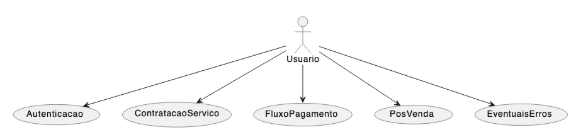
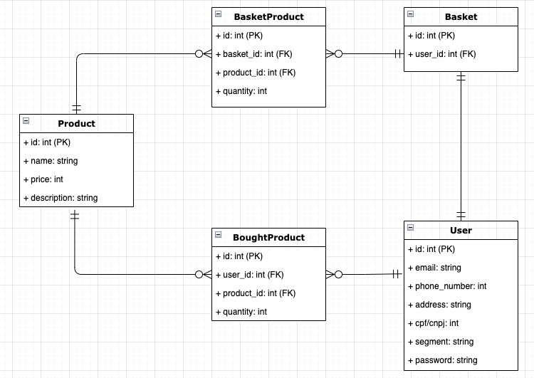
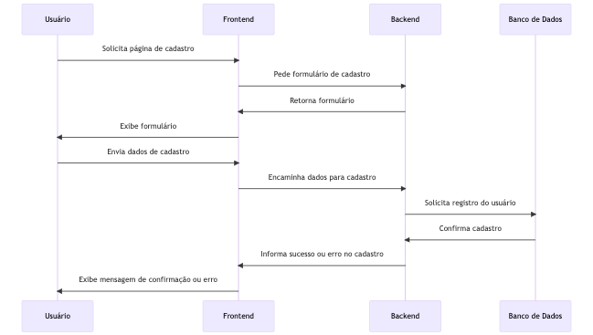
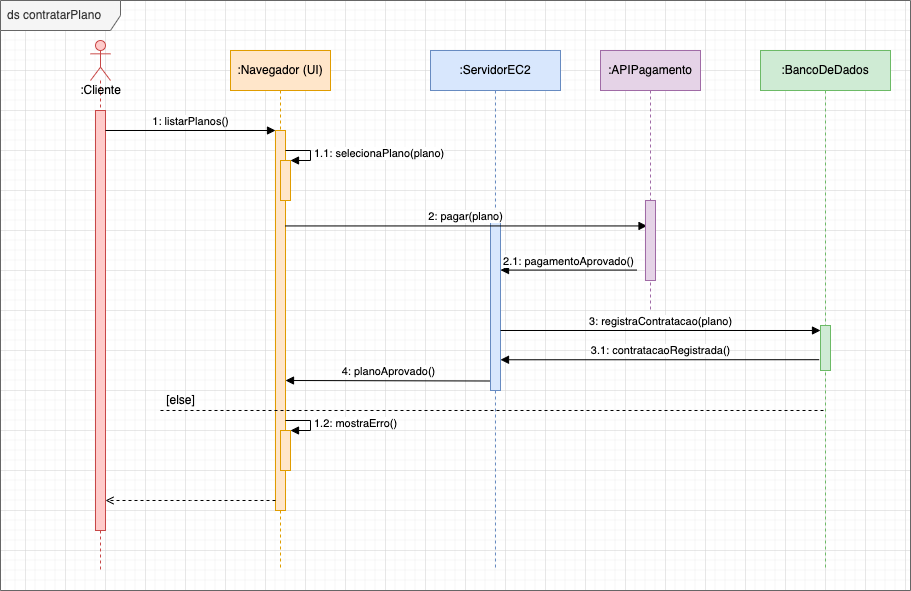
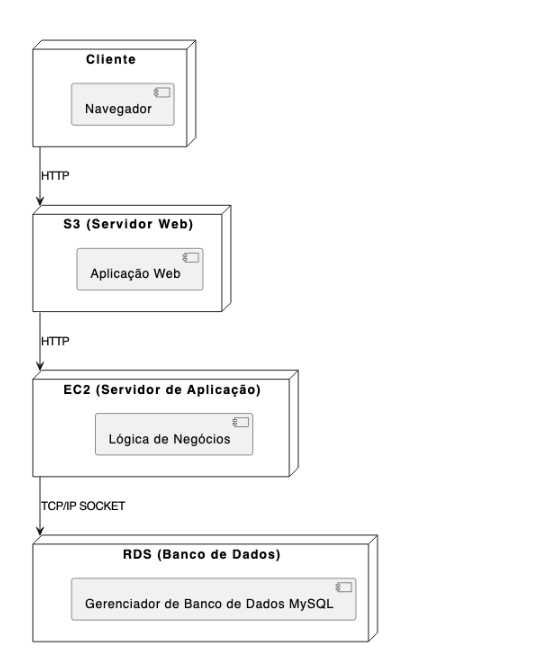

# Modelagem e Implementação

# Diagrama de Casos de Uso

**Descriçao do Diagrama:**

**Autenticação:**

**Escopo:** Autenticação do usuário no sistema.

**Nível:** Usuário.

**Atores:** Usuário.

**Interessados e interesses:** Usuário interessado em acessar sua conta.

**Pré-condições:** O usuário deve ter uma conta registrada.

**Pós-condições:** O usuário é autenticado e tem acesso ao sistema.

**Fluxo Básico:** 
1. O usuário insere suas credenciais e solicita autenticação. O sistema verifica as credenciais e concede acesso.
2. Fluxos alternativos: Se as credenciais estiverem incorretas, o sistema informa o erro ao usuário.
   
**Requisitos especiais:** Nenhum.

**Lista de variantes:** Nenhum.

**Frequência de ocorrência:** Muito frequente.

**Problemas em aberto:** Nenhum.

**Contratação do Serviço:**

**Escopo:** Contratação de um serviço pelo usuário.

**Nível:** Usuário.

**Atores:** Usuário.

**Interessados e interesses:** Usuário interessado em contratar um serviço.

**Pré-condições:** O usuário deve estar autenticado.

**Pós-condições:** O serviço é contratado.

**Fluxo Básico:** 
1. O usuário seleciona o serviço desejado. 
2. Confirma os detalhes 
3. Finaliza a contratação.
   
**Fluxos alternativos:** Se o serviço não estiver disponível, o sistema informa o usuário.

**Requisitos especiais:** Nenhum.

**Lista de variantes:** Nenhum.

**Frequência de ocorrência:** Frequente.

**Problemas em aberto:** Nenhum.

**Fluxo de Pagamento:**

**Escopo:** Processo de pagamento de um serviço.

**Nível:** Usuário.

**Atores:** Usuário.

**Interessados e interesses:** Usuário interessado em pagar por um serviço.

**Pré-condições:** O usuário deve ter selecionado um serviço.

**Pós-condições:** O pagamento é processado.

**Fluxo Básico:** 
1. O usuário insere os detalhes do pagamento e confirma.
2. O sistema processa o pagamento.
   
**Fluxos alternativos:** Se o pagamento falhar, o sistema informa o usuário.

**Requisitos especiais:** Nenhum.

**Lista de variantes:** Nenhum.

**Frequência de ocorrência:** Frequente.

**Problemas em aberto:** Nenhum.

**Pós Venda:**

**Escopo:** Atendimento ao cliente após a venda.

**Nível:** Usuário.

**Atores:** Usuário.

**Interessados e interesses:** Usuário que precisa de suporte ou tem dúvidas após a compra.

**Pré-condições:** O usuário deve ter contratado um serviço.

**Pós-condições:** O usuário é atendido.

**Fluxo Básico:** 
1. O usuário solicita suporte ou tem uma dúvida.
2. Sistema fornece a assistência necessária.
   
**Fluxos alternativos:** Nenhum.

**Requisitos especiais:** Nenhum.

Lista de variantes:** Nenhum.

**Frequência de ocorrência:** Ocasional.

**Problemas em aberto:** Nenhum.

**Eventuais Erros:**

**Escopo**: Tratamento de erros no sistema.

**Nível:** Sistema.

**Atores:** Sistema.

**Interessados e interesses:** Usuário que enfrenta um erro.

**Pré-condições:** Nenhum.

**Pós-condições:** O erro é tratado.

**Fluxo Básico:** 
1. O sistema detecta um erro e informa o usuário.
   
**Fluxos alternativos:** Nenhum.

**Requisitos especiais:** Nenhum.

**Lista de variantes:** Nenhum.

**Frequência de ocorrência:** Raro.

**Problemas em aberto:** Nenhum.

## Diagrama UML de Classes

**Descriçao do Diagrama:**
O sistema é composto por várias entidades que interagem entre si para fornecer uma experiência de compra online.

Product: A entidade "Product" representa um produto individual disponível para compra. Cada produto é identificado de forma única por um ID. Além disso, possui atributos como nome, que descreve o produto; preço, que indica o custo do produto; e descrição, que fornece detalhes adicionais sobre o produto.

Basket: A entidade "Basket" representa o carrinho de compras de um usuário. Cada carrinho está associado a um único usuário, indicado pelo atributo "user_id". O carrinho serve como um local temporário onde os usuários podem adicionar produtos que desejam comprar.

BasketProduct: Esta entidade serve como uma ponte entre "Product" e "Basket". Ela registra quais produtos estão atualmente no carrinho de um usuário e em que quantidade. A entidade "BasketProduct" contém chaves estrangeiras para ambos, o produto e o carrinho, permitindo assim rastrear a relação entre eles.

BoughtProduct: Após a conclusão de uma compra, os detalhes dos produtos comprados são registrados em "BoughtProduct". Ela mantém um registro de quais produtos um usuário comprou, em que quantidade e está associada ao usuário através do "user_id".

User: A classe "User" é central no sistema e representa o perfil de quem utiliza a plataforma. Ela armazena informações pessoais e de contato, garantindo que a comunicação com o usuário seja eficaz. Além disso, detalhes sobre a entrega da maquininha, como endereço e horários preferenciais, são mantidos para a logística de distribuição. Adicionalmente, o usuário tem a opção de selecionar o segmento de mercado em que atua, permitindo uma personalização mais aprofundada da experiência na plataforma.

Em termos de relações, um produto pode ser adicionado a vários carrinhos, refletido na entidade "BasketProduct". Da mesma forma, um usuário pode comprar vários produtos ao longo do tempo, o que é registrado na entidade "BoughtProduct". Por outro lado, um usuário tem um único carrinho de compras associado a ele a qualquer momento.

## Diagrama UML de Sequência

**Descriçao do Diagrama:**

O processo de cadastro começa quando o usuário solicita a página de cadastro. O frontend, ao receber essa solicitação, pede ao backend o formulário de cadastro. O backend, por sua vez, retorna o formulário para o frontend, que o exibe para o usuário. 

O usuário, após preencher as informações necessárias, envia esses dados de cadastro ao frontend. O frontend encaminha esses dados ao backend para processamento. O backend, ao receber os dados, solicita ao banco de dados o registro do novo usuário. 

O banco de dados processa a solicitação e, após registrar o novo usuário, confirma o cadastro ao backend. O backend, por fim, informa ao frontend se o cadastro foi bem-sucedido ou se houve algum erro. O frontend, então, exibe uma mensagem ao usuário, seja ela de confirmação de cadastro bem-sucedido ou de algum erro ocorrido.

**Descriçao do Diagrama:**

O processo de contratação de um plano começa quando o usuário expressa o desejo de visualizar os planos disponíveis. Ele faz essa solicitação através do navegador, que prontamente encaminha o pedido ao servidor EC2. O servidor, por sua vez, busca no banco de dados os detalhes dos planos disponíveis. 

Uma vez obtida a lista de planos do banco de dados, o servidor EC2 retorna essa informação ao navegador, que exibe as opções para o usuário. Após analisar as opções apresentadas, o usuário decide pelo plano que deseja contratar e inicia o processo de pagamento. 

O navegador, ao receber a escolha do usuário, comunica ao servidor EC2 a seleção do plano e a intenção de efetuar o pagamento. O servidor EC2, reconhecendo a necessidade de processar o pagamento, faz uma solicitação à API de Pagamento. Esta API é responsável por gerenciar e confirmar a transação financeira. 

Após o processamento bem-sucedido do pagamento, a API de Pagamento envia uma confirmação ao servidor EC2, informando que o pagamento foi aprovado. Com essa confirmação em mãos, o servidor EC2 procede ao registro da contratação do plano no banco de dados. 

O banco de dados, após registrar com sucesso a contratação, envia uma confirmação de volta ao servidor EC2. Este, por fim, comunica ao navegador que a contratação foi realizada com sucesso. O navegador, então, exibe uma mensagem ao usuário, informando que o plano foi contratado e que o pagamento foi concluído com êxito. 

Em qualquer etapa do processo, se ocorrer uma falha ou erro, seja na API de Pagamento ou no banco de dados, o servidor EC2 é notificado. Ele, por sua vez, informa o navegador, que apresenta ao usuário uma mensagem de erro, orientando-o sobre os próximos passos ou sugerindo que tente novamente.

## Diagrama UML de Implantação

Descrição:

* Cliente:
  * Função: Representa os dispositivos dos usuários, como computadores, smartphones, tablets, etc.
  * Interação: Os clientes acessam a aplicação através de seus navegadores, enviando requisições ao servidor web via protocolo HTTP e recebendo respostas em forma de páginas web.
* S3 (Servidor Web):
  * Função: Este servidor, representado pelo serviço S3 da AWS, é responsável por hospedar a aplicação web. Ele atua como a interface principal entre os usuários finais e o sistema.
  * Interação: Recebe as requisições dos clientes e, em resposta, encaminha essas requisições para o servidor de aplicação quando necessário.
* EC2 (Servidor de Aplicação):
  * Função: Este servidor processa a lógica de negócios da aplicação. Ele atua como um intermediário entre o servidor web e o banco de dados RDS.
  * Interação: Recebe requisições do servidor web via protocolo HTTP, processa-as conforme a lógica de negócios e, em seguida, interage com o RDS conforme necessário. Após o processamento, ele envia as respostas de volta ao servidor web.
* RDS (Banco de Dados):
  * Função: O RDS é o serviço de banco de dados da AWS, e neste diagrama, ele está especificamente representando um "Gerenciador de Banco de Dados MySQL".
  * Interação: O servidor de aplicação consulta e realiza transações com o banco de dados RDS sempre que precisa recuperar ou armazenar informações. A comunicação entre o servidor de aplicação e o RDS é feita através de um protocolo TCP/IP SOCKET.

