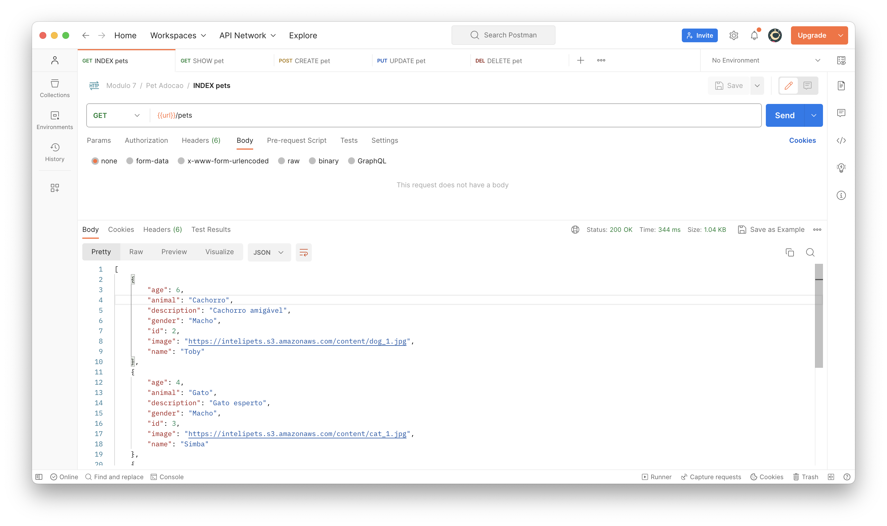
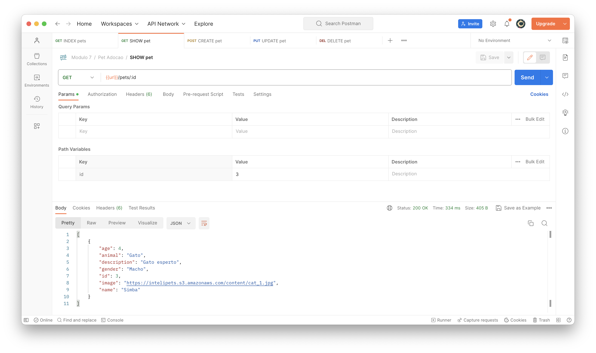
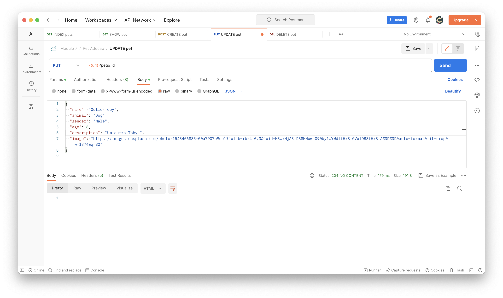
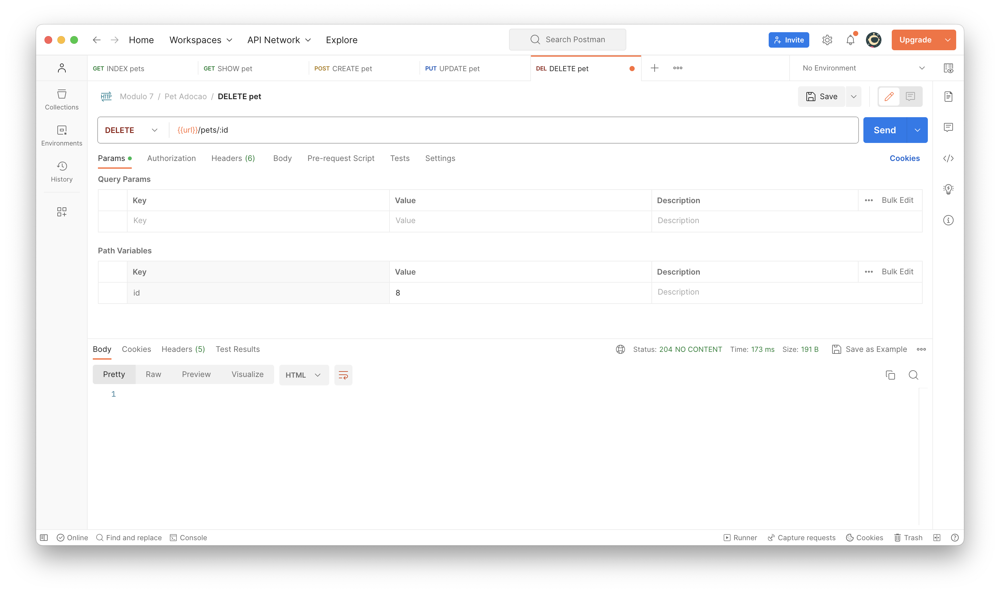

# MVP com deploy da aplicação com arquitetura simples

Este documento corresponde ao que é solicitado no card "MVP com deploy da aplicação com arquitetura básica" na Sprint 1.

## Arquitetura da aplicação

A solução arquitetural proposta para a aplicação MVP elaborada na Sprint 1 é a seguinte:

- Armazenamos os arquivos HTML `index.html`, `edit.html` e `new.html` no AWS Simple Storage Service (S3), junto do código CSS e JavaScript. Com o recurso de Static Website Hosting do S3, podemos acessar esses arquivos através de uma URL pública.
- A partir desses arquivos HTML na URL pública providenciado pelo S3, realizamos requisições Ajax para o Back End. Usamos API fetch para realizar chamadas para uma instância Elastic Cloud Compute (EC2) com um servidor web Nginx, uma interface Python Web Server Gateway Gunicorn e um micro web framework Flask, que roda a partir de um arquivo Python (`index.py`).
- A instância EC2 interage com um banco de dados MySQL gerenciado pela AWS através do Amazon Relational Database Service (RDS). O banco de dados é acessado através de uma URL pública providenciada pelo RDS.

## Resultados dos testes das transações REST

Usamos a plataforma de API [Postman](https://www.postman.com/) para testar as requisições REST que serão realizadas para o Back End.

### Index

Enviamos uma requisição GET para a rota /pets, que retorna um objeto JSON contendo um array com todos os pets cadastrados no banco de dados MySQL no RDS e um status de sucesso (200 OK).

### Show

Enviamos uma requisição GET para a rota /pets/:id, que retorna um objeto JSON com um dos pets cadastrados no banco de dados MySQL no RDS e um status de sucesso (200 OK).

### Create

Enviamos uma requisição POST para a rota /pets, que cria um novo pet no banco de dados MySQL no RDS e retorna um status de sucesso (204 NO CONTENT).

### Update

Enviamos uma requisição PUT para a rota /pets/:id, que atualiza um pet no banco de dados MySQL no RDS e retorna um status de sucesso (204 NO CONTENT).

### Delete

Enviamos uma requisição DELETE para a rota /pets/:id, que deleta um pet no banco de dados MySQL no RDS e retorna um status de sucesso (204 NO CONTENT).

## Vídeos de demonstração

- [Vídeo do console da AWS mostrando a execução de operações CRUD nas tabelas da aplicação criadas no banco de dados AWS RDS](https://www.youtube.com/watch?v=YMM2ZTQbU6M)

- [Vídeo mostrando o front-end implementado em página estática hospedada em AWS S3](https://www.youtube.com/watch?v=MWPiklmMV9A)
