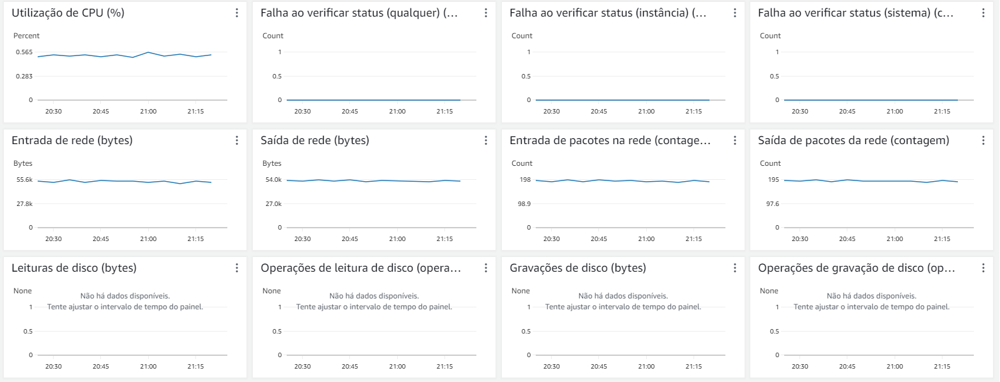
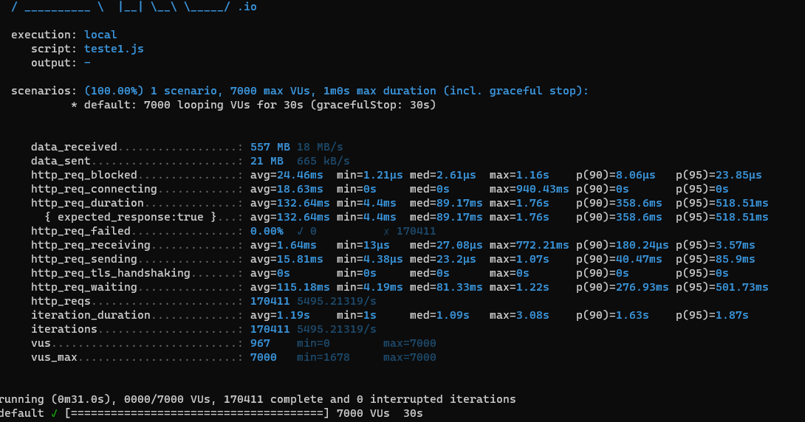
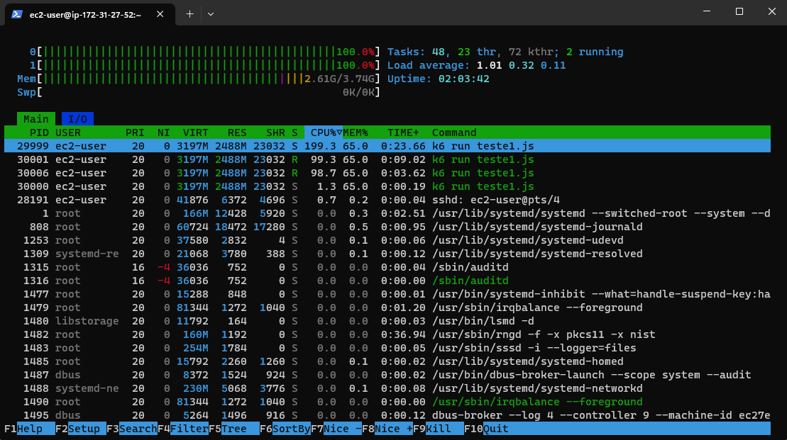

# Relatório Técnico

## Introdução

Este relatório descreve os resultados do teste de carga realizado no sistema sob análise com base no acesso a página de produtos. O teste foi executado em um ambiente local utilizando um script chamado "teste1.js" em uma EC2 t2.medium e os resultados estão detalhados a seguir.

## Ambiente de Teste

- Execução: Local
- Script de Teste: "teste1.js"
- Ferramenta de teste: K6
- Cenário de Teste: Um cenário único com 7.000 VUs (Usuários Virtuais) como o número máximo de usuários simulados que acessam o endpoit do site StoneStore.
- Duração do Teste: 1 minuto (60 segundos), incluindo uma parada suave de 30 segundos.

## Script

Logo abaixo temos o Script usado para realizar o teste e ele consiste em um código JavaScript em que 7 mil usuários virtuais acessam a loja com a URL que passamos logo após, durante o período de 60 segundos e visualizam a página de produtos.

```javascript
import http from 'k6/http';
import { sleep } from 'k6';

export const options = {
  vus: 7000,
  duration: '60s',
};
export default function () {    
  http.get('http://lojinha-stone-inteli.s3-website-us-east-1.amazonaws.com/');  
  sleep(1);            
} 
``` 

## Resultados

### Requisições HTTP

- Total de Requisições: 170.411
- Taxa Média de Requisições por Segundo: 5.495,21/s

### Tempos de Resposta

- Tempo Médio de Bloqueio (http_req_blocked): 24,46 ms
- Tempo Médio de Conexão (http_req_connecting): 18,63 ms
- Tempo Médio de Duração das Requisições (http_req_duration): 132,64 ms
- Tempo Médio de Espera (http_req_waiting): 115,18 ms
- Tempo Médio de Envio (http_req_sending): 15,81 ms

### Falhas de Requisição

- Índice de Falha: 0,00%
- Requisições Bem-sucedidas: 170.411
- Requisições com Falha: 0

### Tráfego de Dados

- Dados Recebidos: 557 MB a uma taxa de 18 MB/s
- Dados Enviados: 21 MB a uma taxa de 665 kB/s

### Duração da Iteração e VUs

- Duração Média da Iteração: 1,19 segundos
- Número de Iterações: 170.411
- Taxa Média de Iterações por Segundo: 5.495,21 iterações/s
- Número Máximo de VUs Ativos: 967 (Limite Máximo: 7.000 VUs)

## Análise

Os resultados do teste de carga do cenário indicam um desempenho geral satisfatório do sistema sob análise:

1. **Falhas de Requisição**: Não foram registradas falhas de requisição, o que é um indicativo positivo de que o sistema conseguiu processar todas as 170.411 requisições com sucesso.

2. **Tempos de Resposta Aceitáveis**: Os tempos médios de bloqueio, conexão, duração das requisições e espera estão em níveis aceitáveis, com a maioria dos valores abaixo de 200 ms. Isso sugere que o sistema está respondendo eficientemente às requisições sob a carga especificada.

3. **Taxa de Iterações Elevada**: A taxa média de iterações por segundo de 5.495,21/s é consideravelmente alta, indicando que o sistema está lidando bem com a carga simulada.

## Dados do sistema durante a execução do teste de carga

A seguir iremos apresentar as imagens que demosntram como o sistema reagiu durante a realização dos teste.

Uso do sistema do site:


Teste realizado usando o K6:


Uso de memória da EC2 de teste:



## Conclusão

O teste de carga do  cenário demonstrou um desempenho satisfatório do sistema, com uma taxa alta de requisições bem-sucedidas e tempos de resposta aceitáveis. Isso sugere que o sistema é capaz de lidar com a carga simulada de 7.000 VUs durante 1 minuto sem problemas significativos em um ambiente local. No entanto, é importante constatar que há uma limitação da máquina usada para testes, afinal, como pudemos perceber nas imagens acima, o uso de 7 mil usuários virtuais causou um efeito de 100% de uso de CPU, enquanto a CPU do sistema testado não passou de 0,56% e isso demonstra uma resiliência muito grande do site desenvolvido. Essa limitação é causada pelos privilégios que nós temos ao learner lab e a sua limitação de uso de instâncias. Ele não permite usar uma EC2 com maiores recursos do que usamos e, por isso, estamos limitados a este teste por conta do processador do sistema de teste. Será necessário continuar monitorando e realizando testes adicionais para garantir que o desempenho seja consistente sob diferentes condições de carga.
