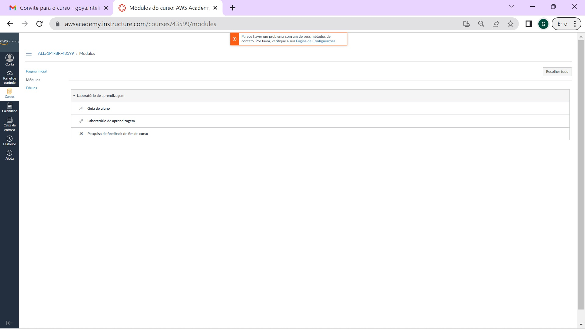

## Ativação da conta na AWS Academy

O desenvolvimento do projeto na AWS utiliza o Learner Lab (Laboratório de Aprendizado). Para isso, o aluno precisa se cadastrar.
1. O procedimento começa recebendo um email com o convite (o nome e o email será o seu, não o do Goya como na figura e o número da turma entre '[]' será diferente do de onde foi copiado e colado...):

2. Ao se aceitar o convite, entra-se no site de cadastro (O número entre '[]' é o número da sua turma no curso e não é exatamente o mesmo da figura):

3. O cadastro registra uma senha, zona de tempo e um email de recuperação:

4. Aceita os termos de serviço e se Registra:

5. Pronto! Entra-se no site da AWS Academy:

6. Para usar o console da AWS, selecione a opção:

7. Aceita os termos de serviço:

8. Na interface do laboratórios, selecione a opção Start Lab:

9. Aguarde o sinal ao lado do AWS ficar verde:

10. Então clique no círculo verde ao lado do AWS:

11. Pronto, estamos no console da AWS:

Para sair, pode-se terminar a sessão do laboratório e, depois, ir para Conta>Sair.

Para se retornar ao AWS Academy, deve-se fazer o login como estudante no:
[site da AWS Academy](https://www.awsacademy.com/vforcesite/LMS_Login)
